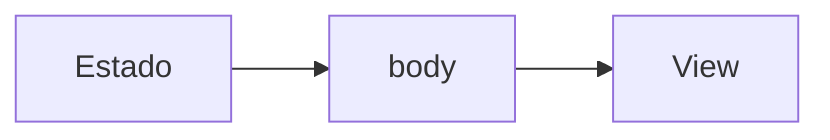

# Swift Decodificado

O **Swift Decodificado** é onde estou juntando estudos, testes e algumas coisas que fui percebendo trabalhando com Swift e iOS.

Comecei pelos fundamentos porque muita coisa mais avançada fica estranha quando a base está meio solta. Mas a ideia não é parar em sintaxe.

Quero passar por comportamento da linguagem, SwiftUI, UIKit, arquitetura, modelagem de estado, memória, concorrência, testes e outros pontos que começam a importar de verdade quando o código cresce.

Os conteúdos misturam texto, código, diagramas e exemplos que dá para abrir, alterar e quebrar.

[Site](https://www.swiftdecodificado.com) · [YouTube](https://www.youtube.com/@swiftdecodificado) · [GitHub](https://github.com/swiftdecodificado)

## Conteúdo

O material está organizado em algumas frentes:

- **Swift:** fundamentos, optionals, enums, structs, collections, generics, protocolos e comportamento da linguagem.
- **Estruturas de dados:** arrays, stacks, queues, linked lists, trees, graphs e análise de complexidade.
- **SwiftUI:** estado, navegação, composição de views, lifecycle, layout, performance e integração com código existente.
- **UIKit:** View Code, Auto Layout, ciclo de vida, navegação, delegates, collection views e manutenção de projetos mais antigos.
- **Arquitetura iOS:** MVVM, MVVM-C, modularização, Dependency Injection, Swift Package Manager e organização de features.
- **Concorrência:** async/await, `Task`, Actors, isolamento e problemas que aparecem quando existe suspensão no meio do fluxo.
- **Testes:** XCTest, XCUITest, test doubles, ViewModels e proteção de regras de negócio.

Alguns assuntos formam **trilhas de estudo**, com uma ordem sugerida de leitura. Outros ficam no **Caderno** como textos independentes.

Mesmo dentro de uma trilha, tento fazer cada artigo funcionar sozinho.

## Como escrevo

Não queria fazer mais uma sequência de textos explicando `var`, `let`, `struct` e seguindo para o próximo assunto.

Sempre que consigo, tento mostrar onde aquele conceito começa a fazer diferença.

Às vezes isso termina em poucas linhas de Swift. Em outros casos precisa de um diagrama, de um teste ou de um projeto separado para ficar mais fácil de enxergar.

Quando o exemplo cresce demais para caber no artigo, o código fica em outro repositório e o link acompanha o conteúdo.

Parte dos estudos também vira vídeo. A ideia é aproveitar os mesmos exemplos e continuar o raciocínio com mais espaço para mexer no código.

## Estrutura do projeto

O site é feito com [Astro](https://astro.build/) e o conteúdo principal continua em Markdown.

```text
contents/
├── pt/
│   ├── artigos/
│   └── ...
└── articles/

src/
├── assets/covers/   # capas (otimizadas pelo Astro)
├── components/
├── config/          # site.ts, topics.json e covers.json
├── integrations/    # verificação do build e publicação dos diagramas
├── layouts/
├── lib/             # artigos, assuntos, capas e dados de cada página
├── markdown/        # plugins: callouts, ids de títulos, código e Mermaid
│   └── diagrams/    # serviço Excalidraw e configuração do Mermaid
├── pages/
├── scripts/         # melhoria progressiva no navegador
└── styles/

public/              # arquivos públicos (diagramas legados, figuras, labs, ícones)
scripts/             # novo artigo e geração de capas
tests/
```

### Conteúdo

O português é o idioma principal e fica na raiz de `contents/`:

```text
contents/index.md        # home
contents/sobre/
contents/caderno/<slug>/index.md   # publicados
contents/privado/<slug>/index.md   # rascunhos, só na máquina do autor
```

O inglês (ainda sem conteúdo publicado) terá o mesmo formato em `contents/en/` (`en/notebook/<slug>/`). As pastas não definem a URL; as rotas vêm de `routeOf` em `src/config/site.ts`.

Cada artigo usa front matter para guardar informações como título, descrição, assunto, data, ordem de leitura, capa e data de revisão.

A home e as páginas de assunto consultam esse conteúdo para montar listas de artigos, trilhas e textos recentes.

## Trilhas e Caderno

Os assuntos do site ficam definidos em:

```text
src/config/topics.json
```

Um assunto pode funcionar de duas formas.

### Trilha

Uma trilha representa um estudo com sequência.

Ela pode ter:

- ordem de leitura;
- quantidade total de textos;
- progresso;
- pré-requisitos;
- textos planejados.

As páginas ficam em URLs como:

```text
/trilhas/swift/
/trilhas/swiftui/
```

### Caderno

Nem tudo precisa fazer parte de uma sequência.

Textos independentes ficam no Caderno, organizados pelo assunto:

```text
/caderno/<slug>/
```

Isso deixa espaço para escrever sobre algo que estou estudando sem precisar encaixar artificialmente o texto em um curso.

## Diagramas

Os diagramas que fazem parte dos artigos começam em Mermaid dentro do próprio Markdown.

Fluxogramas podem ser convertidos para uma representação visual baseada em Excalidraw durante a geração do site.

A fonte continua simples:



A versão publicada vira SVG estático.

Com isso, o artigo não depende de JavaScript para exibir o diagrama e a fonte do desenho continua versionada junto com o texto.

Diagramas também precisam de uma descrição acessível usando `accDescr`.

## Capas

Cada artigo publicado possui uma capa associada ao conteúdo.

As capas ficam em:

```text
src/assets/covers/
```

O front matter do artigo referencia (idioma, canonical, alternates e imagem de compartilhamento são derivados):

```yaml
cover:
coverAlt:
```

As versões em português e inglês do mesmo artigo podem compartilhar a mesma imagem.

A ideia é que a capa ajude a reconhecer o assunto sem virar decoração solta. Para artigos sobre variáveis, concorrência, memória ou navegação, por exemplo, tento representar visualmente o conceito principal.

## Layout editorial

A leitura é o centro do layout.

O texto principal usa uma coluna mais estreita, enquanto diagramas, figuras e tabelas podem aproveitar uma área maior quando precisam de espaço.

O site também possui:

- tema claro e escuro;
- syntax highlighting para Swift;
- botão de copiar nos blocos de código;
- navegação entre artigos;
- breadcrumb por assunto;
- indicação de artigos revisados;
- páginas próprias para assuntos e trilhas;
- metadata Open Graph e Twitter;
- dados estruturados para artigos;
- suporte a conteúdo em português e inglês.

O visual usa como referência interfaces e documentação da Apple, mas sem tentar copiar o site da Apple.

## Publicação

O site é publicado no GitHub Pages através do workflow:

```text
.github/workflows/deploy.yml
```

A publicação acontece a partir da `main`.

Antes do deploy, o projeto valida o conteúdo, gera páginas estáticas, processa diagramas, capas, CSS e outros recursos usados pelos artigos.

O domínio publicado é:

**https://www.swiftdecodificado.com**

## Quem está escrevendo

Sou **Luan Rodrigues**, Software Engineer com foco em iOS.

Trabalho com Swift, SwiftUI e UIKit desde 2019.

O Swift Decodificado acabou virando o lugar onde concentro coisas que estou estudando, revisando ou tentando entender melhor sem deixar tudo perdido entre playgrounds, projetos e anotações.

[LinkedIn](https://www.linkedin.com/in/luandsrodrigues/)