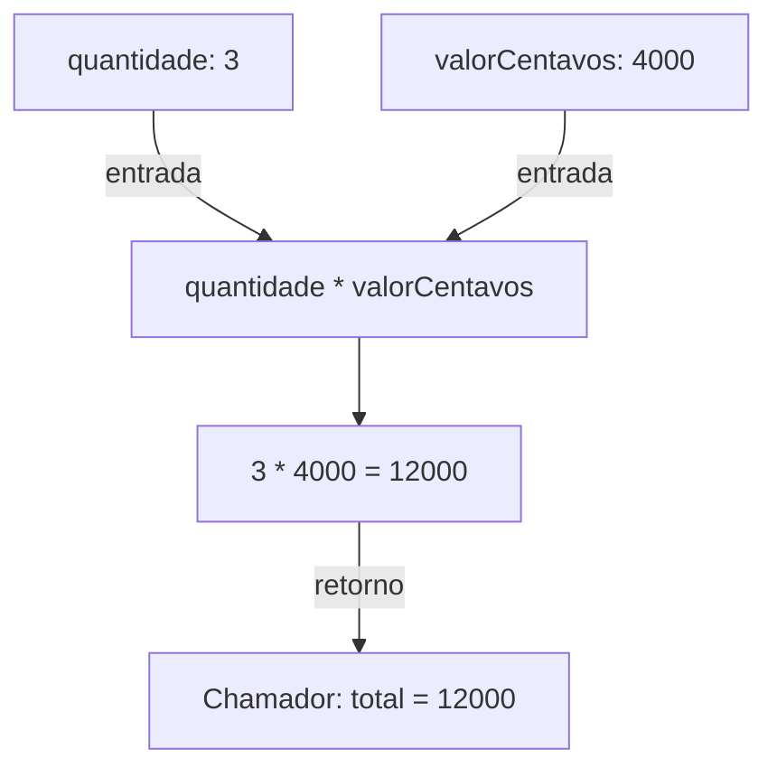

Numa função, o que mais diz sobre ela vem antes do corpo: dá para saber o que entra, quais nomes aparecem na chamada e o que deve voltar, sem ler uma linha do que ela faz.

Um parcelamento tem três parcelas de R$ 40,00, ou 4.000 centavos cada. O total é 12.000 centavos. Podemos escrever a multiplicação no lugar em que precisamos dela, ou dar um nome a esse cálculo para usá-lo com outras parcelas:

> **Para executar**
>
> Cada bloco Swift deste artigo é independente. Salve um por vez em `Funcoes.swift` e rode `swift Funcoes.swift`. Eles usam apenas a linguagem e a biblioteca padrão.

```swift
func totalDasParcelas(quantidade: Int, valorCentavos: Int) -> Int {
    return quantidade * valorCentavos
}

let total = totalDasParcelas(quantidade: 3, valorCentavos: 4_000)
print(total) // 12000
```

Uma função reúne um trabalho sob um nome. Para executá-lo, fazemos uma **chamada**, como `totalDasParcelas(quantidade: 3, valorCentavos: 4_000)`. Só declarar a função não executa a multiplicação.

## O contrato aparece antes das chaves

`func` inicia a declaração. Os parênteses descrevem as entradas. A seta `-> Int` informa o tipo do resultado. Entre as chaves está o corpo, o trabalho que a função realiza.

`quantidade` e `valorCentavos` são **parâmetros**: nomes pelos quais o corpo acessa suas entradas. Os números 3 e 4.000 são os **argumentos** passados nessa chamada. Os parâmetros têm tipos definidos; passar `"três"` onde se espera `Int` é um erro de compilação.



As setas acompanham os valores da chamada até o cálculo e de volta ao chamador. A função retorna `12000`; quem chama decide guardá-lo em `total`.

Cada chamada executa o corpo com suas próprias entradas. Se chamarmos com duas parcelas de 5.000 centavos, o resultado será 10.000; a chamada anterior não deixou 3 e 4.000 presos aos parâmetros.

`return` encerra aquela execução e entrega o valor ao chamador. No exemplo, o resultado fica em `total`. A função também poderia ser usada dentro de outra expressão, como uma soma. Esse retorno é o que permite compor cálculos sem depender do console ou de uma interface.

## O nome na chamada pode ser diferente do nome no corpo

Uma chamada precisa ser legível de fora. Dentro da função, outro nome pode tornar a conta mais clara:

```swift
func total(de valorCentavos: Int, com taxaPercentual: Int = 2) -> Int {
    return valorCentavos + valorCentavos * taxaPercentual / 100
}

print(total(de: 10_000))          // 10200
print(total(de: 10_000, com: 5))  // 10500
```

`de` e `com` são **argument labels**, os rótulos usados por quem chama. `valorCentavos` e `taxaPercentual` são os nomes usados dentro do corpo. O valor padrão 2 permite omitir o segundo argumento. Se o chamador informar 5, a função usará 5 naquela execução.

Quando só há um nome, como em `valorCentavos: Int`, ele serve para os dois lugares. O `_` remove o rótulo da chamada:

```swift
func centavos(_ reais: Int) -> Int {
    return reais * 100
}

print(centavos(12)) // 1200
```

Aqui `centavos(12)` já comunica a intenção. Em uma função com várias entradas do mesmo tipo, como origem e destino de uma transferência, os rótulos podem evitar inversões que o compilador não detectaria: dois valores podem ser `Int` e ter significados diferentes.

| Na chamada | No corpo |
| --- | --- |
| `de: 10_000` | `valorCentavos = 10_000` |
| `com: 5` | `taxaPercentual = 5` |
| `centavos(12)` | `reais = 12` |

O rótulo identifica o argumento na chamada; o corpo usa o nome do parâmetro.

## Retornar e imprimir produzem efeitos diferentes

```swift
func comprovante(para destinatario: String) -> String {
    return "Transferência para \(destinatario) concluída."
}

func mostrarComprovante(para destinatario: String) {
    print(comprovante(para: destinatario))
}

let texto = comprovante(para: "Bia")
print(texto.uppercased()) // TRANSFERÊNCIA PARA BIA CONCLUÍDA.
mostrarComprovante(para: "Rui") // Transferência para Rui concluída.
```

`comprovante` entrega uma `String`; quem a recebe decide o que fazer com ela. `mostrarComprovante` escreve no console e não entrega uma string ao chamador. Quando omitimos o tipo de retorno, Swift usa `Void`, também escrito `()`: uma tupla vazia, sem um resultado útil para guardar.

Uma função pode retornar algo **e** produzir efeitos, como alterar um objeto ou escrever um arquivo. A assinatura, sozinha, não promete ausência de efeitos. Retornar o comprovante permite testar seu conteúdo ou exibi-lo em um label sem também escrever no console.

Em funções cujo corpo é uma única expressão, Swift permite omitir `return`. Por exemplo, `func centavos(_ reais: Int) -> Int { reais * 100 }` tem o mesmo resultado da versão anterior. Isso não transforma `print` em uma expressão que devolve o texto impresso.

## Quando há caminhos diferentes, cada resultado precisa existir

Queremos um resultado diferente quando o pagamento é à vista. A função ainda precisa devolver uma `String` independentemente do caminho executado:

```swift
func descricao(parcelas: Int) -> String {
    if parcelas == 1 {
        return "À vista."
    }

    return "Em \(parcelas)x."
}

print(descricao(parcelas: 1)) // À vista.
print(descricao(parcelas: 3)) // Em 3x.
```

`==` compara os valores. Quando a condição é verdadeira, o primeiro `return` encerra a chamada; o segundo não é executado. Quando é falsa, o fluxo continua até o último retorno. Uma função que promete `String` não pode terminar normalmente sem produzir uma string.

O tipo `Int` ainda permite zero e valores negativos. Se isso for inválido no domínio, a função precisa representar essa regra de alguma forma: validando a entrada, retornando ausência de resultado ou comunicando um erro.

## Alterar uma variável local não altera o argumento original

Os parâmetros comuns não podem receber uma nova atribuição dentro da função. Para fazer uma conta em etapas, podemos criar uma variável local:

```swift
func comTarifa(_ valorCentavos: Int) -> Int {
    // valorCentavos += 250 // Erro: o parâmetro não aceita nova atribuição.
    var resultado = valorCentavos
    resultado += 250
    return resultado
}

let original = 10_000
let atualizado = comTarifa(original)
print(original, atualizado) // 10000 10250
```

`resultado` pertence à execução da função. O inteiro de `original` continua sendo 10.000. Guardar o retorno em `atualizado` deixa essa separação explícita.

Isso vale para o `Int`. Com uma instância de class, o parâmetro recebe uma referência ao mesmo objeto, diferença que o artigo de [valores e referências](/artigos/value-reference-semantics/) explora.

## inout torna a alteração do valor do chamador explícita

Quando a intenção é atualizar a própria variável passada, o contrato pode usar `inout`:

```swift
func debitar(_ valorCentavos: Int, de saldoCentavos: inout Int) {
    saldoCentavos -= valorCentavos
}

var saldo = 10_000
debitar(2_500, de: &saldo)
print(saldo) // 7500
```

O `&` na chamada marca o acesso que permite alterar `saldo`. Um literal como 10_000 ou uma constante com `let` não pode ocupar esse lugar. O modelo de `inout` é receber o valor, modificá-lo e escrevê-lo de volta ao fim da chamada; não é uma promessa de um endereço de memória específico.

`inout` também tem regras próprias de acesso exclusivo à variável passada, que ficam para um texto dedicado.

Para uma transformação que produz um novo valor, eu manteria o retorno. Para uma operação cujo propósito é modificar o valor fornecido, `inout` deixa essa intenção visível no ponto de chamada.

Referências: [funções em Swift](https://docs.swift.org/swift-book/documentation/the-swift-programming-language/functions/), [in-out parameters](https://docs.swift.org/swift-book/documentation/the-swift-programming-language/functions/#In-Out-Parameters) e [declaração de funções](https://docs.swift.org/swift-book/documentation/the-swift-programming-language/declarations/#Function-Declaration). Uma função também pode ser guardada e passada como valor, ponto de partida das closures. Quando os dados e as operações descrevem um mesmo valor, uma [struct](/artigos/structs-em-swift/) pode reunir esse contrato.
