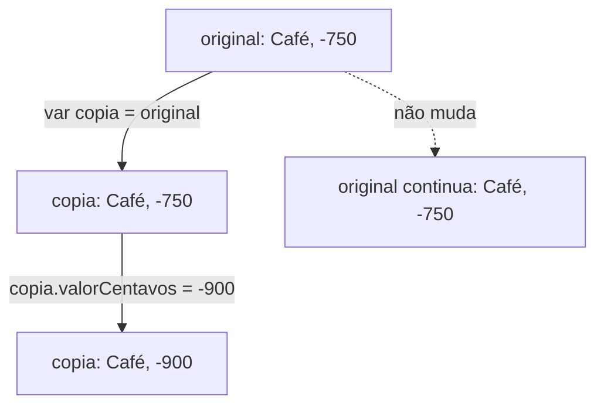

`struct` costuma ser apresentada como um jeito de juntar propriedades, e isso explica pouco do que a torna útil em Swift. Uma struct é um valor inteiro: pode ser criada, copiada, modificada e até proteger as próprias regras.

Uma transação tem uma descrição e um valor. Em variáveis soltas, é fácil usar a descrição de uma transação com o valor de outra. Podemos reuni-las em um valor que representa a transação inteira:

```swift
struct Transacao {
    var descricao: String
    var valorCentavos: Int
}

let cafe = Transacao(descricao: "Café", valorCentavos: -750)
print(cafe.descricao, cafe.valorCentavos) // Café -750
```

`struct Transacao` declara um **tipo**: a forma dos valores que o programa poderá criar. A chamada `Transacao(descricao: "Café", valorCentavos: -750)` constrói uma **instância**, um valor concreto desse tipo. `descricao` e `valorCentavos` são propriedades, os dados que pertencem à instância. O ponto em `cafe.descricao` acessa uma delas.

Os exemplos são independentes. Salve um bloco por vez em `Structs.swift` e execute `swift Structs.swift`, com Swift instalado. O código não depende de frameworks de interface.

## A declaração descreve o tipo; a inicialização cria o valor

Declarar `Transacao` não cria automaticamente um café ou um salário. Podemos construir várias instâncias a partir do mesmo tipo:

```swift
struct Transacao {
    var descricao: String
    var valorCentavos: Int
}

let cafe = Transacao(descricao: "Café", valorCentavos: -750)
let salario = Transacao(descricao: "Salário", valorCentavos: 300_000)
print(cafe.valorCentavos + salario.valorCentavos) // 299250
```

Não escrevemos um `init`, mas Swift forneceu um **memberwise initializer**, um inicializador formado a partir das propriedades armazenadas. Para esta struct, sem inicializadores próprios, ele recebe `descricao` e `valorCentavos`. As regras de geração e de acesso ficam em [initialization](https://docs.swift.org/swift-book/documentation/the-swift-programming-language/initialization/#Memberwise-Initializers-for-Structure-Types).

Esse conforto não valida os dados. `Transacao(descricao: "", valorCentavos: 0)` também respeita os tipos declarados: a `String` vazia e o zero são valores válidos para eles. Se uma descrição vazia ou um valor zero não fizer sentido, o tipo precisa acrescentar uma regra de construção ou de alteração.

## O que acontece quando uma transação é atribuída a outra variável?

```swift
struct Transacao {
    var descricao: String
    var valorCentavos: Int
}

let original = Transacao(descricao: "Café", valorCentavos: -750)
var copia = original
copia.valorCentavos = -900

print(original.valorCentavos, copia.valorCentavos) // -750 -900
```

`copia` recebe o valor de `original` naquele momento. Depois, alterar `copia.valorCentavos` modifica a transação guardada em `copia`. A transação de `original` continua com -750. As duas variáveis não se tornaram nomes para um único objeto `Transacao`.



O diagrama compara os valores antes e depois da mutação. As propriedades deste exemplo são `String` e `Int`, e as caixas não afirmam uma estratégia de alocação nem uma cópia física de memória.

Essa é uma consequência de structs serem **value types**. O modelo permite raciocinar sobre valores independentes quando seus componentes também têm semântica de valor, como `String` e `Int` neste caso. O comportamento observável é o de valores independentes; isso não exige que o compilador copie fisicamente todos os bytes a cada atribuição.

Passar essa transação para uma função segue a mesma regra. Para a função alterar o valor da variável do chamador, o contrato precisaria receber `inout` ou devolver um novo valor para o chamador atribuir, como no artigo de [funções](/artigos/funcoes-em-swift/).

## let protege o valor inteiro

```swift
struct Transacao {
    let id: Int
    var descricao: String
}

var transacao = Transacao(id: 42, descricao: "Café")
transacao.descricao = "Café da manhã"
// transacao.id = 43 // Erro: a propriedade id é let.

let retrato = transacao
// retrato.descricao = "Padaria" // Erro: a instância está em uma constante.
print(transacao.descricao, retrato.descricao) // Café da manhã Café da manhã
```

Há duas decisões diferentes. `id` não pode receber outro valor depois da inicialização daquela instância. `descricao` pode mudar, desde que a transação inteira esteja em uma variável que permita essa mutação. Por isso, `retrato.descricao = "Padaria"` falha mesmo que a propriedade tenha sido declarada com `var`: ela alteraria o valor da struct guardada em `retrato`, que é `let`.

Isso permite tratar aquele valor como somente leitura: uma rotina que recebe essa transação sem precisar modificá-la não consegue alterar diretamente suas propriedades.

## Propriedades calculadas evitam guardar a mesma informação duas vezes

Um cartão tem limite de R$ 50,00, ou 5.000 centavos. Com 2.000 usados, sobram 3.000. Guardar o limite, o usado **e** o disponível como três números mutáveis permitiria esquecer de atualizar um deles. Podemos derivar o disponível dos outros dois:

```swift
struct LimiteDoCartao {
    let totalCentavos: Int
    var usadoCentavos: Int

    var disponivelCentavos: Int {
        return totalCentavos - usadoCentavos
    }
}

var limite = LimiteDoCartao(totalCentavos: 5_000, usadoCentavos: 2_000)
print(limite.disponivelCentavos) // 3000
limite.usadoCentavos += 1_000
print(limite.disponivelCentavos) // 2000
```

`totalCentavos` e `usadoCentavos` são propriedades armazenadas. `disponivelCentavos` é uma **computed property**: seu corpo calcula o resultado quando a propriedade é lida. Nesta implementação, não existe outro número de disponível para manter sincronizado.

Ela é declarada com `var` porque essa é a sintaxe de uma propriedade calculada. Isso não significa que qualquer pessoa possa fazer `limite.disponivelCentavos = 10_000`: escrevemos apenas um getter, o código de leitura. Não fornecemos um setter, o código que permitiria atribuir por essa propriedade.

A conta ainda aceita estados ruins se alguém modificar `usadoCentavos` livremente. Vamos fazer a regra do limite pertencer ao próprio tipo.

## O tipo pode concentrar suas próprias regras

```swift
struct LimiteDoCartao {
    let totalCentavos: Int
    private(set) var usadoCentavos: Int = 0

    var disponivelCentavos: Int {
        return totalCentavos - usadoCentavos
    }

    init(totalCentavos: Int) {
        precondition(totalCentavos >= 0, "O limite precisa ser não negativo.")
        self.totalCentavos = totalCentavos
    }

    mutating func reservar(_ valorCentavos: Int) -> Bool {
        guard valorCentavos >= 0, valorCentavos <= disponivelCentavos else {
            return false
        }
        usadoCentavos += valorCentavos
        return true
    }
}

var limite = LimiteDoCartao(totalCentavos: 5_000)
print(limite.reservar(3_000)) // true
print(limite.reservar(4_000)) // false
print(limite.usadoCentavos, limite.disponivelCentavos) // 3000 2000
```

Um método é uma função que pertence ao tipo. Como `reservar` altera `usadoCentavos`, ele precisa ser `mutating`: essa palavra permite modificar `self`, o valor sobre o qual o método está operando. Chamar esse método em um limite declarado com `let` seria um erro de compilação.

`private(set)` permite ler `usadoCentavos` de fora, mas restringe a atribuição à declaração de `LimiteDoCartao` e a extensions no mesmo arquivo. O chamador não consegue fazer `limite.usadoCentavos = 100`; precisa usar uma operação que respeite as regras do limite. O `guard` exige um valor não negativo que caiba no disponível. Se isso não acontecer, a função retorna `false` antes de mudar qualquer propriedade.

O `init` controla a criação. `self.totalCentavos` é a propriedade; `totalCentavos` à direita do `=` é o parâmetro recebido. `usadoCentavos` já tem o valor inicial zero. Como escrevemos o inicializador dentro da declaração, passamos a oferecer esse contrato em vez do memberwise initializer automático.

`precondition` trata um limite negativo como erro de programação: ela pode encerrar a execução se o chamador violar essa exigência. Entradas externas exigiriam outra estratégia de validação.

Com as operações apresentadas, `usadoCentavos` permanece entre zero e `totalCentavos`. Essa regra é um **invariante**: uma condição que o tipo se compromete a preservar depois de criar ou modificar seu valor. A struct ganhou comportamento porque havia uma regra concreta para proteger.

Uma struct ainda pode armazenar referências para objetos compartilhados; essa diferença aparece quando comparamos [value e reference semantics](/artigos/value-reference-semantics/).

Referências: [structs e classes](https://docs.swift.org/swift-book/documentation/the-swift-programming-language/classesandstructures/), [propriedades](https://docs.swift.org/swift-book/documentation/the-swift-programming-language/properties/), [métodos mutating](https://docs.swift.org/swift-book/documentation/the-swift-programming-language/methods/#Modifying-Value-Types-from-Within-Instance-Methods) e [controle de acesso](https://docs.swift.org/swift-book/documentation/the-swift-programming-language/accesscontrol/#Getters-and-Setters). Para representar alternativas com dados diferentes, veja [enums](/artigos/enums-em-swift/).
