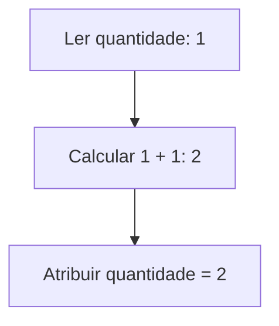
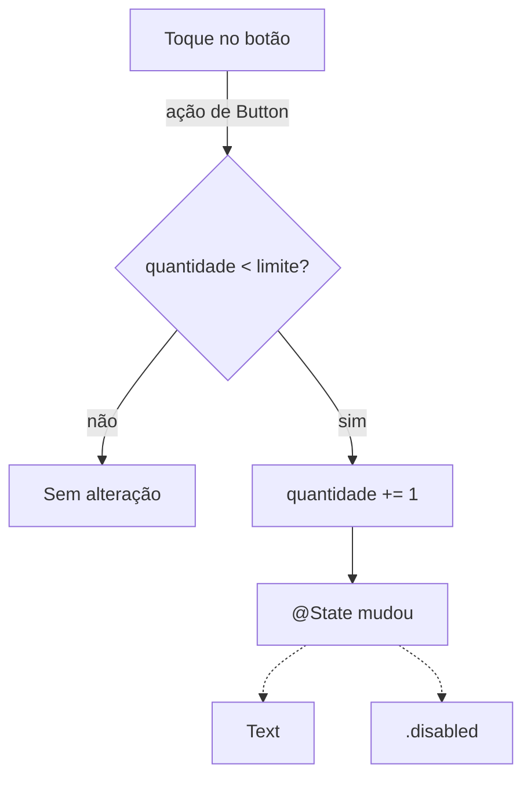
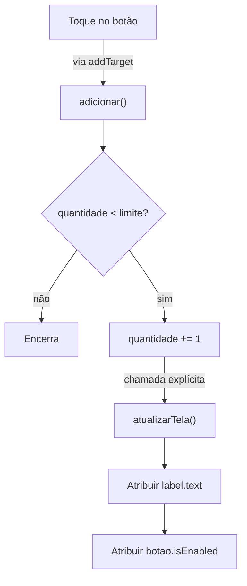

Um contador mostra **1**. Você toca em “Adicionar” e ele passa a mostrar **2**. Antes de desenhar o botão, precisamos representar esse número e dizer como ele pode mudar:

> **Para executar**
>
> Os primeiros exemplos rodam sem interface: salve **um bloco por vez** em `Variaveis.swift` e execute `swift Variaveis.swift` no terminal, com Swift instalado. Os componentes de interface ao final usam um projeto iOS no Xcode.

```swift
var quantidade = 1
quantidade = quantidade + 1
print(quantidade) // 2
```

`quantidade` é o nome que usamos para acessar um valor. Na segunda linha, Swift lê o valor atual, soma 1 e guarda o resultado de volta. Na terceira, `print` escreve esse resultado no console, a área de texto em que podemos acompanhar uma execução.

## Nome, tipo e valor são coisas diferentes

Podemos deixar a declaração mais explícita:

```swift
var quantidade: Int = 1
quantidade = 2
print(quantidade) // 2
```

`var` permite atribuir um novo valor. `quantidade` é o nome. `Int` é o tipo, que representa números inteiros. `1` é o valor inicial. Os dois-pontos introduzem o tipo; o sinal `=` faz a atribuição.

Na atribuição `quantidade = quantidade + 1`, o valor atual é lido antes de o resultado ocupar seu lugar:



As setas mostram a ordem de avaliação de `quantidade = quantidade + 1`. O nome `quantidade` e o tipo `Int` permanecem; muda o valor encontrado na próxima leitura. As caixas não representam posições físicas de memória.

O tipo também determina operações disponíveis. Dois inteiros podem ser somados; uma `String` representa texto. A anotação `: Int` não é obrigatória quando o valor inicial já permite ao compilador concluir o tipo. Essa conclusão é a **inferência de tipos**.

```swift
var saldoCentavos = 10_000      // Int
let titular = "Bia"             // String
let taxa: Double = 0.025        // Número com parte fracionária
let contaAtiva = true           // Bool: true ou false

saldoCentavos = 12_500
// saldoCentavos = "doze mil"   // Erro: saldoCentavos é Int, e "doze mil" é uma String.
print(saldoCentavos, titular, taxa, contaAtiva)
// 12500 Bia 0.025 true
```

Inferir o tipo não significa escolher outro tipo a cada atribuição. `saldoCentavos` continua sendo `Int`. E Swift também não converte um número de um tipo para outro por conta própria, nem no meio de uma conta:

```swift
let colunas = 3
let larguraDaColuna = 96.5
// print(colunas * larguraDaColuna) // Erro: * não combina Int com Double sem conversão.
let larguraTotal = Double(colunas) * larguraDaColuna
print(larguraTotal) // 289.5
```

`Double(colunas)` cria um novo valor, `3.0`, do tipo `Double`. `colunas` continua sendo o `Int` 3. Na prática, a anotação explícita é útil quando o tipo escolhido muda o significado da conta, como uma divisão entre inteiros ou uma divisão com parte fracionária.

## Escolha let quando o valor deve permanecer

O contador pode variar, mas vamos limitar sua quantidade a cinco itens:

```swift
let limite = 5
var quantidade = 1

quantidade += 1
print(quantidade < limite) // true
// limite = 10            // Erro: limite foi declarado com let.
```

`+= 1` é uma forma curta de somar 1 ao valor e atribuir o resultado de volta. `<` compara os números e produz um `Bool`. Já `let` declara uma constante: depois da inicialização, outra atribuição a esse nome é um erro de compilação.

Comece com `let` quando o valor não precisa mudar. Escolha `var` quando existe uma mudança concreta a representar. Isso permite que quem lê o código identifique quais valores precisam ser acompanhados durante a execução.

Uma constante pode receber seu primeiro valor depois da declaração, desde que Swift consiga verificar que ela foi inicializada antes da leitura:

```swift
let contaPremium = true
let limiteDeAnexos: Int

if contaPremium {
    limiteDeAnexos = 10
} else {
    limiteDeAnexos = 3
}

print(limiteDeAnexos) // 10
```

Os dois caminhos inicializam `limiteDeAnexos`. Eles não alteram uma constante que já tinha valor. Essa diferença entre inicializar e reatribuir também aparece nos [inicializadores de structs](/artigos/structs-em-swift/).

## Quando o valor muda, a cópia muda junto?

`retrato` recebe `quantidade` e, logo depois, `quantidade` ganha mais 1. `retrato` acompanha?

```swift
var quantidade = 1
let retrato = quantidade

quantidade += 1
print(quantidade, retrato) // 2 1
```

Não acompanha. Quando `retrato` recebe `quantidade`, recebe o inteiro **1 daquele momento**. A atribuição não cria uma ligação que será refeita toda vez que `quantidade` mudar. Isso importa para evitar guardar uma segunda cópia de algo que deveria ser calculado a partir do estado atual. Para um `Int`, cada nome fica com o seu valor: é o comportamento que chamamos de **value semantics**. Vamos comparar com o caso das referências no artigo de [value e reference semantics](/artigos/value-reference-semantics/).

## O mesmo contador em SwiftUI

Agora o valor precisa aparecer na tela. Neste componente, o botão acrescenta um item até atingir cinco.

> **Para executar**
>
> O exemplo usa SwiftUI em iOS 15 ou posterior. Adicione o código a um arquivo Swift de um projeto iOS App; para abrir a tela, use `ContadorSwiftUI()` no lugar da view inicial dentro do `WindowGroup` do app.

```swift compile
import SwiftUI

struct ContadorSwiftUI: View {
    @State private var quantidade = 1
    private let limite = 5

    var body: some View {
        VStack(spacing: 16) {
            Text("Quantidade: \(quantidade)")
                .font(.title2)

            Button("Adicionar") {
                if quantidade < limite {
                    quantidade += 1
                }
            }
            .buttonStyle(.borderedProminent)
            .disabled(quantidade >= limite)
        }
        .padding()
    }
}
```

Aqui aparecem algumas peças de interface. `VStack` organiza os componentes na vertical; `Text` descreve o texto; `Button` recebe o trabalho a executar no toque. `\(quantidade)` insere o valor atual na frase. `body` descreve a interface a partir dos dados disponíveis, e `some View` diz que `body` devolve uma view de um tipo específico, que o compilador conhece sem que o código precise escrevê-lo.

`@State` é a peça que conecta a mudança à interface. SwiftUI administra o armazenamento desse estado, e a leitura de `quantidade` cria uma dependência: quando o estado muda, o framework pode atualizar as views afetadas. Sem `@State`, com uma propriedade `var` comum, `quantidade += 1` nem compila dentro do botão: a view é uma struct, e o código de `body` não pode alterar as propriedades dela. Declaramos o estado como `private` porque este componente é responsável por ele.

E o `= 1`? Ele define o valor inicial do estado. SwiftUI mantém esse estado separado dos novos valores da struct `ContadorSwiftUI`. `@State` também não guarda o contador entre execuções do aplicativo.

A condição do botão é calculada a partir de `quantidade` e `limite`. Não precisamos guardar outro `@State` chamado `botaoDesabilitado`, que teria de permanecer sincronizado com os números.

**SwiftUI: a interface depende do estado**



As setas contínuas seguem a ação do botão; as tracejadas indicam dependências: `Text` e `.disabled` leem `quantidade`. As setas não representam chamadas manuais nem uma ordem de reavaliação de `body`.

## Em UIKit, a atualização do componente fica explícita

Este controller faz o mesmo trabalho. Estes são os métodos que alteram o contador e atualizam a interface.

> **Para executar**
>
> O exemplo UIKit completo abaixo inclui o layout e o adaptador para SwiftUI. Coloque-o em outro arquivo do mesmo projeto iOS e use `ContadorUIKitDemo()` no `WindowGroup` para abrir a tela.

**ContadorViewController · alteração do estado e atualização da tela**

```swift fragment
@objc private func adicionar() {
    if quantidade < limite {
        quantidade += 1
        atualizarTela()
    }
}

private func atualizarTela() {
    label.text = "Quantidade: \(quantidade)"
    botao.isEnabled = quantidade < limite
}
```

<details>
<summary>Ver o exemplo UIKit completo, com layout e integração ao SwiftUI</summary>

**ContadorUIKit.swift · implementação completa**

```swift compile
import UIKit
import SwiftUI

final class ContadorViewController: UIViewController {
    private var quantidade = 1
    private let limite = 5
    private let label = UILabel()
    private let botao = UIButton(type: .system)

    override func viewDidLoad() {
        super.viewDidLoad()
        view.backgroundColor = .systemBackground

        label.font = .preferredFont(forTextStyle: .title2)
        label.adjustsFontForContentSizeCategory = true
        label.numberOfLines = 0
        label.textAlignment = .center
        botao.configuration = .filled()
        botao.setTitle("Adicionar", for: .normal)
        botao.addTarget(self, action: #selector(adicionar), for: .touchUpInside)

        let pilha = UIStackView(arrangedSubviews: [label, botao])
        pilha.axis = .vertical
        pilha.alignment = .center
        pilha.spacing = 16
        pilha.translatesAutoresizingMaskIntoConstraints = false
        view.addSubview(pilha)

        NSLayoutConstraint.activate([
            pilha.centerXAnchor.constraint(equalTo: view.safeAreaLayoutGuide.centerXAnchor),
            pilha.centerYAnchor.constraint(equalTo: view.safeAreaLayoutGuide.centerYAnchor),
            pilha.leadingAnchor.constraint(greaterThanOrEqualTo: view.safeAreaLayoutGuide.leadingAnchor, constant: 24),
            pilha.trailingAnchor.constraint(lessThanOrEqualTo: view.safeAreaLayoutGuide.trailingAnchor, constant: -24)
        ])
        atualizarTela()
    }

    @objc private func adicionar() {
        if quantidade < limite {
            quantidade += 1
            atualizarTela()
        }
    }

    private func atualizarTela() {
        label.text = "Quantidade: \(quantidade)"
        botao.isEnabled = quantidade < limite
    }
}

struct ContadorUIKitDemo: UIViewControllerRepresentable {
    func makeUIViewController(context: Context) -> ContadorViewController {
        ContadorViewController()
    }

    func updateUIViewController(_ controller: ContadorViewController, context: Context) {}
}
```

</details>

O controller guarda os números e os componentes. `viewDidLoad` prepara a tela uma vez por carregamento da view. A pilha e as constraints posicionam o conteúdo; a parte decisiva para o contador está em `adicionar` e `atualizarTela`.

O registro com `addTarget` conecta o toque ao método `adicionar`. Depois de alterar o inteiro, chamamos `atualizarTela` para copiar sua representação em texto para `label.text`. Se removermos essa chamada, a propriedade `quantidade` continuará mudando, mas este código não atualizará o texto.

O `label` foi declarado com `let`, mas sua propriedade `text` muda. Isso funciona porque `UILabel` é uma classe: a constante guarda sempre a referência para o mesmo objeto, mas não congela o objeto. `label = UILabel()` seria outra operação, trocar a referência, e essa o `let` impede: não compila. Já `quantidade`, um `Int`, precisa de `var` para receber o próximo número.

**UIKit: a atualização da tela é explícita**



Aqui é a chamada a `atualizarTela()` que leva o novo inteiro ao texto e ao botão. Os dois exemplos são programas separados, cada um com sua `quantidade`: ao chegar a 5, o botão fica desabilitado nos dois, e o caminho “não” protege a ação caso ela seja executada com a quantidade já no limite.

O botão real altera uma única quantidade. A interface e a condição de habilitação são derivadas dela. Esse é o ponto para acompanhar em uma tela maior: qual valor pode mudar, quem é responsável por mudá-lo e qual caminho leva essa mudança ao que o usuário vê.

Referências: [constantes, variáveis e tipos em Swift](https://docs.swift.org/swift-book/documentation/the-swift-programming-language/thebasics/), [conversão entre tipos numéricos](https://docs.swift.org/swift-book/documentation/the-swift-programming-language/thebasics/#Numeric-Type-Conversion), [`State`](https://developer.apple.com/documentation/swiftui/state), [estado da interface em SwiftUI](https://developer.apple.com/documentation/swiftui/managing-user-interface-state/), [target-action](https://developer.apple.com/documentation/uikit/responding-to-control-based-events-using-target-action) e [`UILabel`](https://developer.apple.com/documentation/uikit/uilabel). Para dar um nome ao trabalho que usa esses valores, continue em [funções](/artigos/funcoes-em-swift/).
